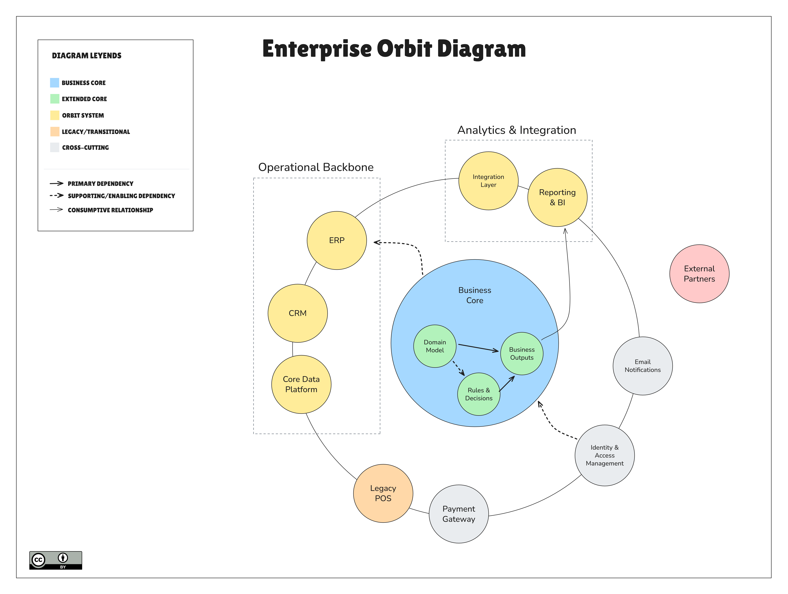

# Enterprise Orbit Diagram — Canonical Example

This document presents the **canonical example** of the Enterprise Orbit Diagram (EOD).

The purpose of this example is to provide a **single, clear reference implementation** of the method. It demonstrates how narrative intent, positioning, grouping, and visual conventions work together to communicate enterprise structure to non-technical and strategic audiences.

This example should be understood as **illustrative, not prescriptive**. Organizations may adapt the diagram to their context while respecting the core conventions.

---

## Canonical Example: Enterprise Orbit Diagram

### Context

An organization needs to explain its enterprise software landscape to business stakeholders as an initial discovery artifact. Existing documentation is either missing or overly technical, making it difficult to understand which elements truly define the business versus those that merely support it.

The goal of this diagram is to create a **shared mental model** of the organization’s technology landscape, highlighting what is core, what extends the core, and what enables the business.

---

### Business Core

At the center of the diagram is the **Business Core**.

This represents the primary business capability that defines the organization’s value proposition. It is not a single system, but a conceptual boundary containing the essential elements that produce business value.

Within the Business Core, **extended core components** may appear, such as domain models, rules, and business outputs. These elements are tightly coupled to the business meaning and evolve together.

---

### Orbiting Systems

Surrounding the Business Core are the **Orbiting Systems**.

These systems directly support or operationalize the core business capability and are positioned based on **business criticality**, not technical architecture or layering.

Examples include:

- Core operational platforms
- Systems of record closely tied to the domain
- Strategic applications that shape how the business operates

Systems positioned closer to the core are harder to replace and more tightly coupled to business outcomes.

---

### Cross-Cutting, Legacy, and External Systems

Some systems enable the organization without defining or extending its core business model. These systems are intentionally positioned **outside the core groupings**.

Typical examples include:

- Identity & Access Management
- Payment Gateways
- Email & Notifications
- External Partners
- Legacy or transitional systems

Their placement communicates **enablement, dependency, or transition**, rather than differentiation.

---

### Narrative Outcome

Without reading a single technical specification, stakeholders can answer questions such as:

- What capabilities define the business?
- What belongs to the core versus what supports it?
- Which systems are critical, and which are replaceable?
- Where does the organization’s true complexity live?

The diagram acts as a **conversation starter**, not a technical contract.

---

### Visual Reference

---

This canonical example represents **version 1** of the Enterprise Orbit Diagram in practice. Future examples may explore additional scenarios while preserving this reference model.
